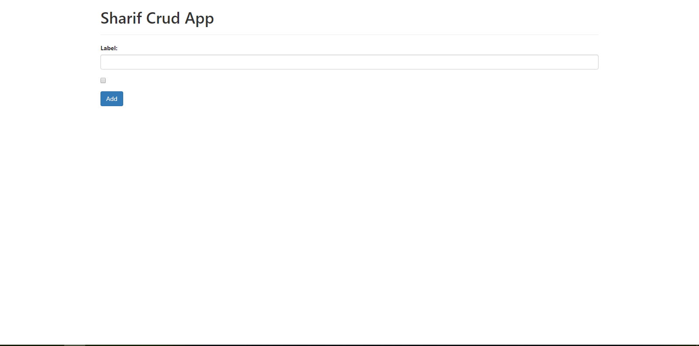
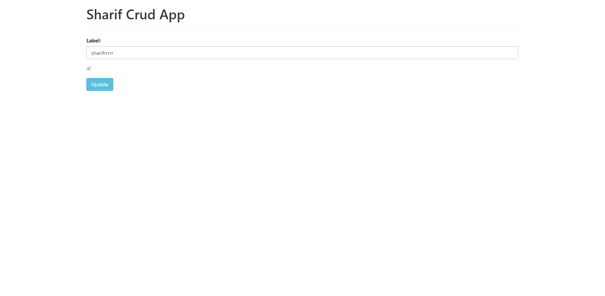

This project was bootstrapped with [Create React App](https://github.com/facebook/create-react-app).

## Available Scripts

In the project directory, you can run:

First you need be install `yarn` in your computer if that is not installed. 

Then you need to run `yarn install` for all node modules inside the project folder

Finally you need to do this inside the project folder to run the app.

### `yarn start`

Runs the app in the development mode. 
Open [http://localhost:3000](http://localhost:3000) to view it in the browser.

Please see the screenshot to see the view

